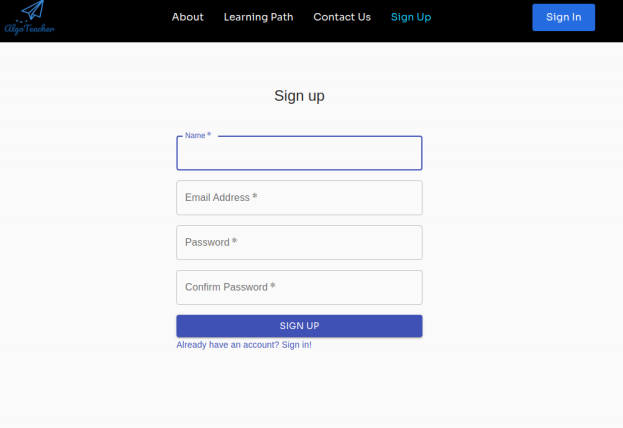
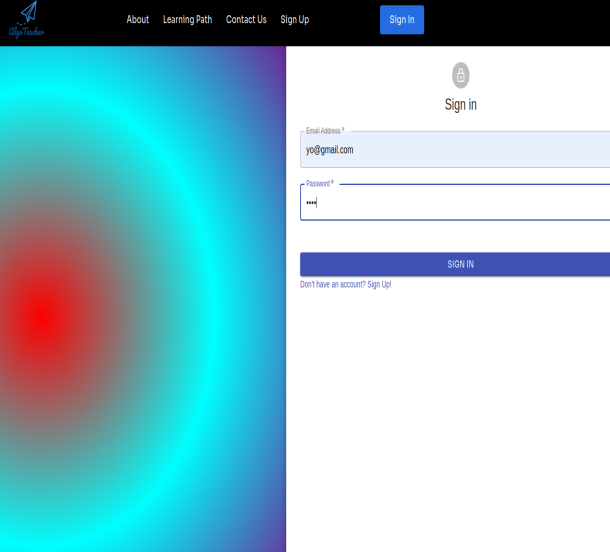
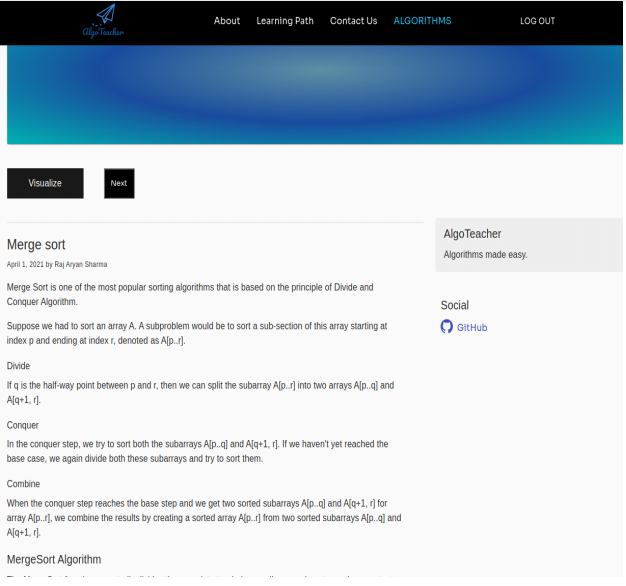
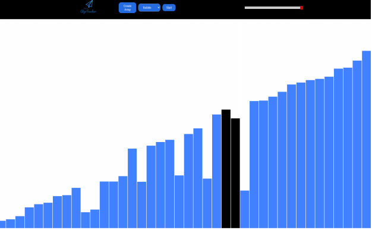

# Algo Teacher

<!-- Copy-paste in your Readme.md file -->

### Algorithm Visualisation Project

To start the API (for signup/signin):
  -> cd src  
  -> node api1.js 
#### Remember to change the ip address in the signup.js and signin.js pages to your current ip address.

To start the App:
  -> npm install 
  -> npm start

